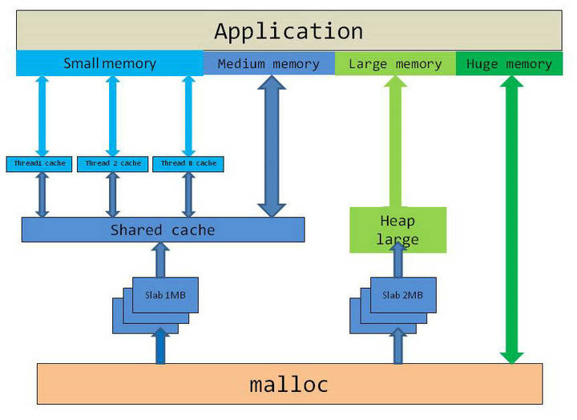
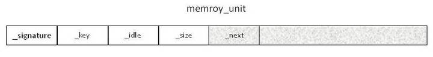
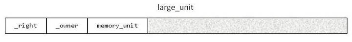

## Background
All projects that I had worked on, it was never rare to encounter and solve problems like memory leaks, double free a block of memory, free invalid pointers etc. Some projects had its own memory allocator, because, for a long period of time, developers had complained about the performance of Windows malloc. However, it was not clear to me how bad Windows malloc was, neither did I find any articles about it. In 2010, my curiosity reached to a point that I wanted to find out by myself. heapperf was developed first with VS2010 on Windows 7, soon later teisye was developed to compare with Windows 7 malloc. The work was stopped in 2013, didn't compare with Linux, didn't publish anything, all seemed to be just a private work.

In 2017, I happened to know that VS2017 supports C++11 very well, specifically std::thread_local and std::atomic features, I started thinking to finish the work. 

## Design
Teisye is dialect of Xian, China, which means "good". Teisye assumes that same code path will be excuted over and over again during an application lifetime,  same size of allocation and deallocation will be requested repeatly, memory blocks of small size are requested most, then the medium size, then the large size, huge size is the least. Base on the assumption, teisye uses different strategies as shown below.

<b>thread\_cache</b> uses a hash map to manage memory blocks of small size, each thread has one. The hash key is normalized size key, each hash slot uses teisye::stack to manage free memory blocks. teisye::stack is not a contianer, it requires each node to has a member named _next. Since concurrence does not happen in thread_cache, the performance of thread_cache is the best. When a slot of thread_cache is empty, teisye will ask shared_cache to allocate memory. When a thread exists, all slots will be merged into shared_cache.

<b>shared\_cache</b> is mainly for medium size memory allocations, it uses same data structure and algorithm as thread\_cache, except each slot uses teisye::stack\_sl or teisye::atomic\_stack\_v depends on processor. teisye::stack\_sl uses spin lock technique. teisye::atomic\_stack\_v uses sdk::atomic and versioning techniques for ABA problem, teisye::atomic\_stack\_v is lock free.

<b>heap\_large</b> is for large size memory allocations, it supports merging, uses std::atomic for lock free concurrence.

For huge size memory allocations, teisye forwards to malloc.

Each memory block has a memory\_unit as header as shown below. <b>\_signature</b> takes 2 bytes, is used to check if a memory block is allocated by teisye, thus, deallocating a wild pointer wouldn't cause teisye to crash most likely. <b>\_key</b> is the hash key, takes 1 byte. <b>\_idle</b> takes 1 byte, indicates if a memory block is free or not, thus, double free a memory block wouldn't cause teisye to crash most likely. <b>\_size</b> takes 4 bytes, is the actual size requested. <b>\_next</b> links to the next free memory block when it is free, or it is part of user data when it is allocated.

Large memory unit has two more fields as shown below. <b>\_right</b> points to the right memory block, <b>\_owner</b> points to its owner slab.

memory\_unit and large\_unit are allocated from slabs, slabs are allocated by malloc.

## heapperf
heapperf uses <b>std::chrono::high\_resolution\_clock</b> to accumulate the cost of each allocation and deallocation, and then reports statistics prior to exist. heapperf measures the performance of following cases:     
1. <b>wc</b>: uses std::regex to count number of words in a small text.  
2. <b>512b</b>: 0 bytes to 512 bytes allocations and deallocations, including 8 bytes header.  
3. <b>8kb</b>: 512 bytes to 8kb allocations and deallocations, including 8 bytes header.  
4. <b>128kb</b>: 8kb + 1b to 128kb allocations and deallocations, including 8 bytes header.  
5. <b>huge</b>: 128kb + 1b to 130kb allocations and deallocations, including 8 bytes header.

Each case contains following items:  
1. <b>AT</b>: average allocation time in cycles on x86/x64, in nanoseconds on arm.  
2. <b>AC</b>: total allocation count.   
3. <b>DT</b>: average deallocation time in cycles x86/x64, in nanoseconds on arm.    
4. <b>DC</b>: total deallocation count.

Here is an example of heapperf report:  

	allocator: tsalloc
	number of threads: 1
	number of loops: 10
	run duration(ms): 530
	number of logic processors: 4
	peak working set(KB): 2304
	private usage(KB): 3556
	CASE              AT              AC              DT              DC
	wc                89           19372              80           19370
	512b              88            5050              78            5050
	8kb               99           76800              82           76800
	1mb              122           58510              89           58510
	huge             345           20710             356           20710
	

## How To Build 
### Windows
VC++ 2017 is required to build teisye on Windows, it can be built from Visual Studio IDE, or use the command below at a VC++ command line:

    msbuild /p:Configuration="Release" /p:Platfrom=x64 teisye.sln

### Linux
GCC 6.3 or above is required to build teisye on Linux. Specifies DEBUG=1 to make command to build debug version, specifies SHARED=1 to make command to build heapperf that uses teisye.so. For examples:

    make clean all
    make DEBUG=1 clean all
    make SHARED=1 clean all

## Benchmarks
- [20180502-win7.md](benchmarks/20180502-win7.md)  
- [20180502-ubuntu1604LTS.md](benchmarks/20180502-ubuntu1604LTS.md)  
- [20180503-raspberrypi.md](benchmarks/20180503-raspberrypi.md)  
