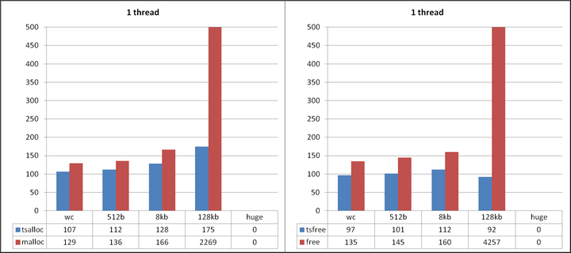
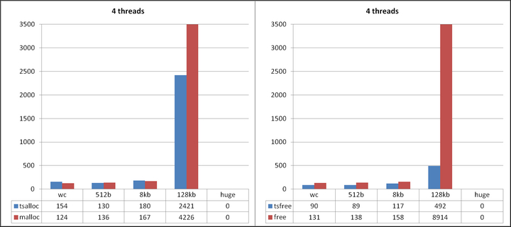
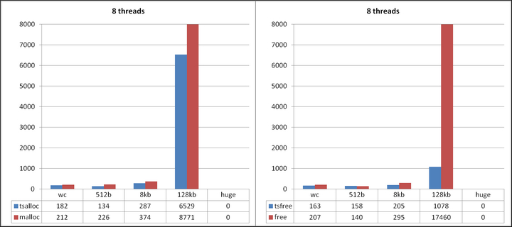
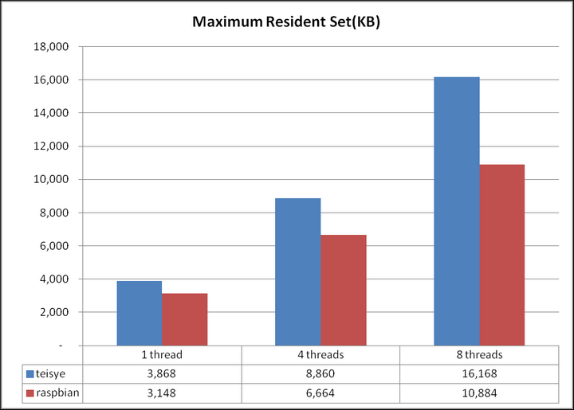

	Machine model: HP Pavilion 11 x360 Laptop
	CPU: Intel(R) Pentium(R) CPU  N3520  @ 2.16GHz
	RAM: 4G
	OS: Ubuntu 17.10.1 64bit
	Compiler: g++ 7.2
	heapperf: x86_64-linux-gnu, 3 loops, wc 512b 8k 128k

  

  
