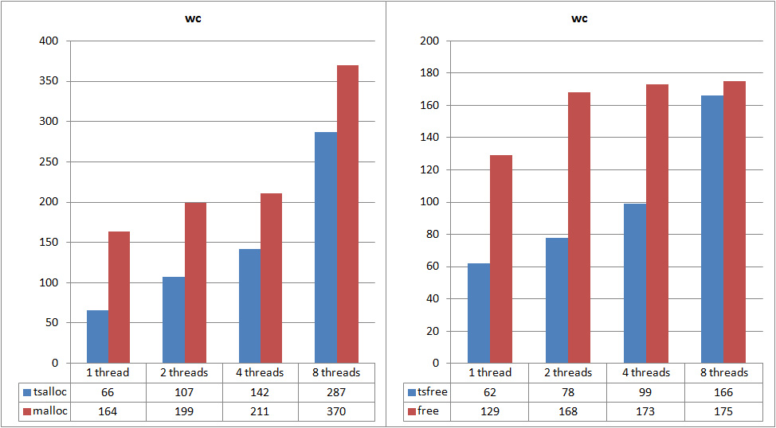
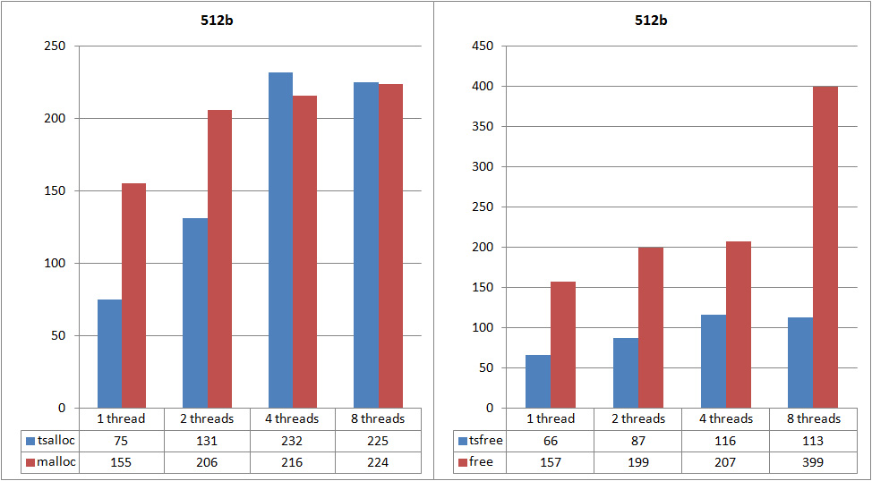
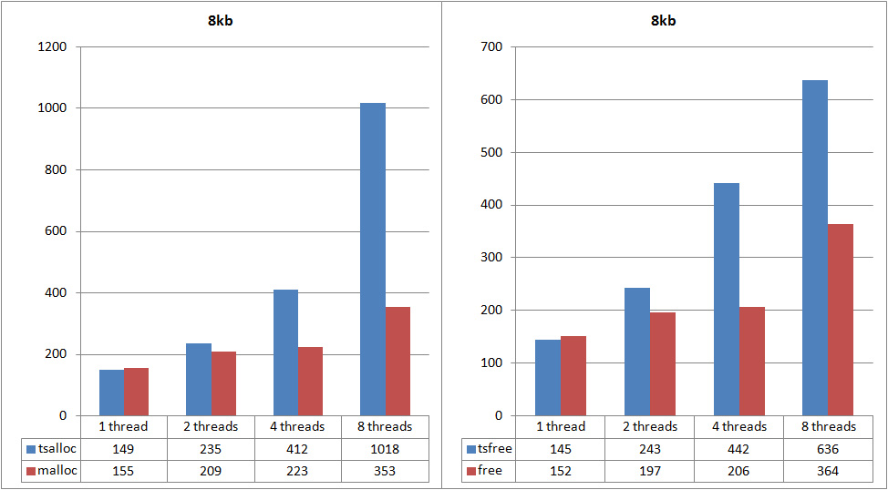
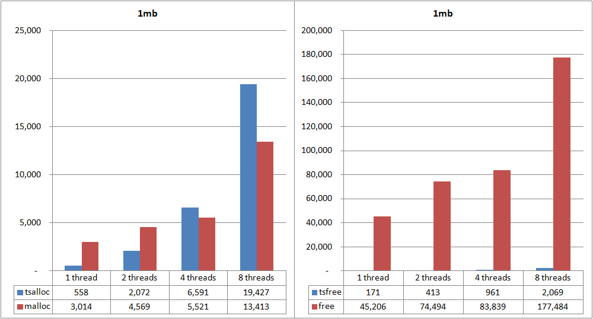
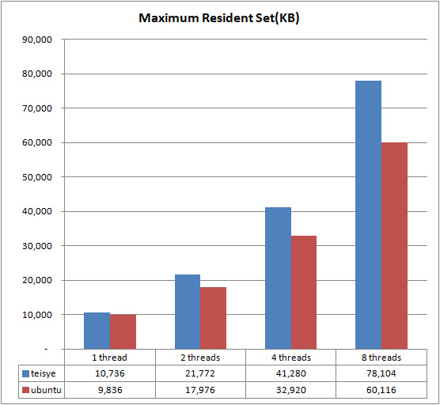

	Machine model: Lenovo IdeaPad U310 Touch
	CPU: Intel(R) Core(TM) i3-3227U CPU @ 1.90GHz
	RAM: 4G
	OS: Ubuntu 16.04.4 LTS 64bit
	Compiler: gcc (Ubuntu 5.4.0-6ubuntu1~16.04.9) 5.4.0 20160609
	heapperf: x86_64-linux-gnu, -l 3 -c 15

  

  

  
