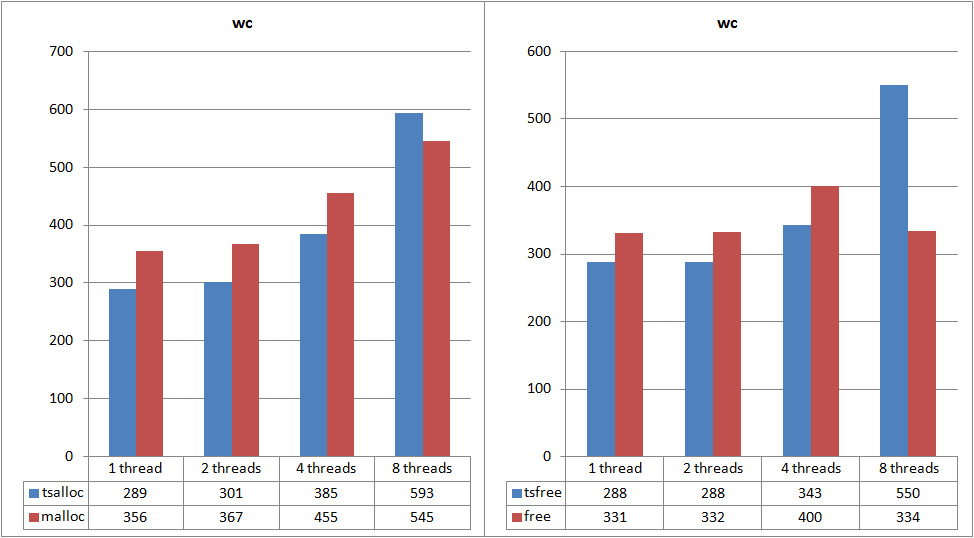
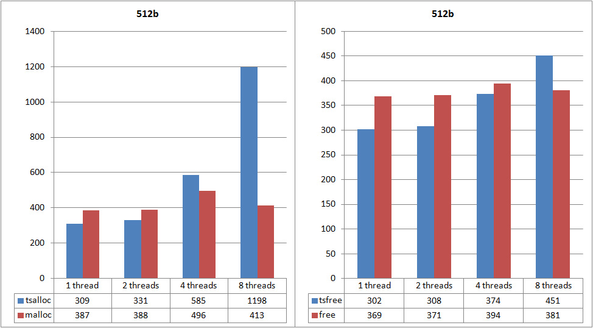
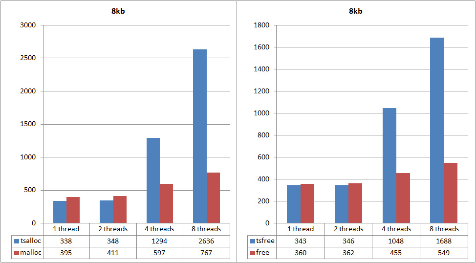
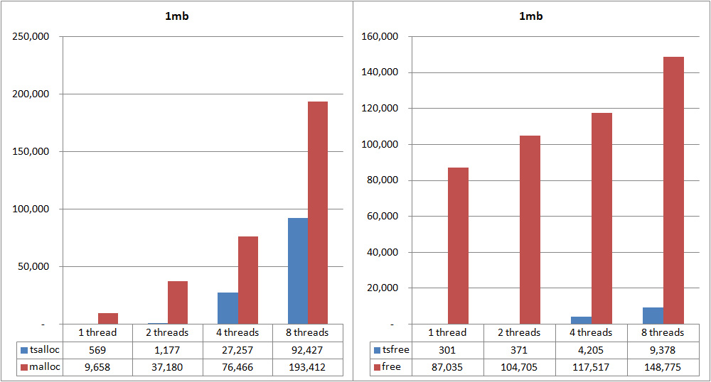
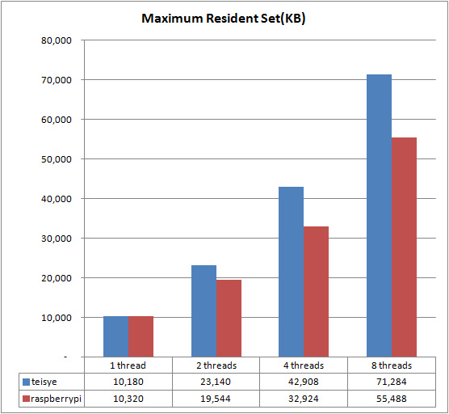

	Machine model: Raspberry Pi 3b
	CPU: 1.2GHz Broadcom BCM2837
	RAM: 1G
	OS: Raspbian-scretch 32bit
	Compiler: gcc (Raspbian 6.3.0-18+rpi1+deb9u1) 6.3.0 20170516
	heapperf: arm-linux-gnueabihf, -l 3 -c 15

  

  

  
