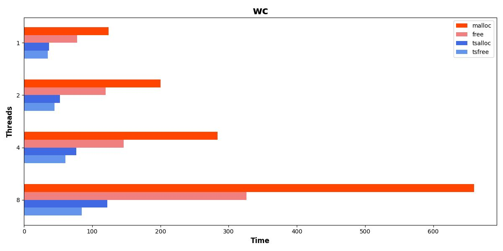
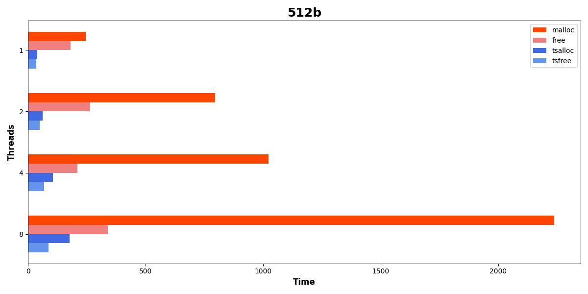
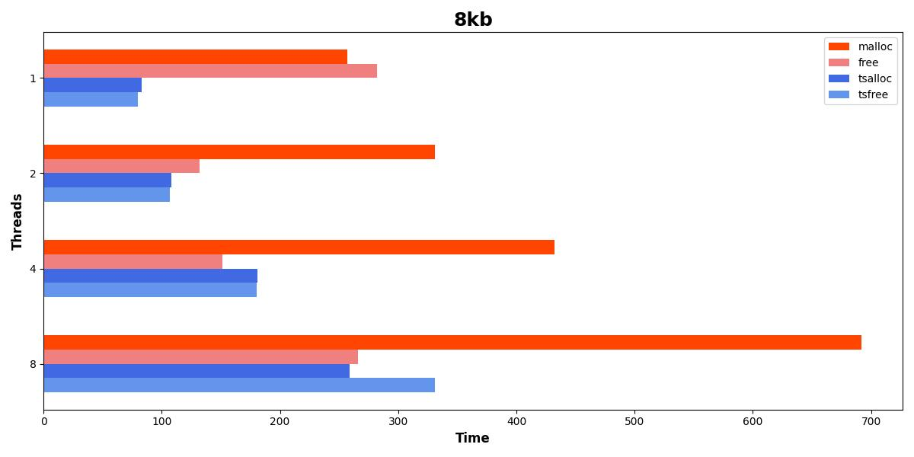
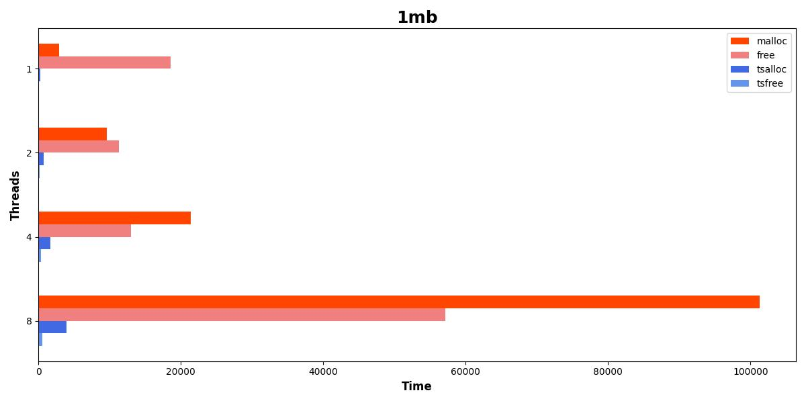
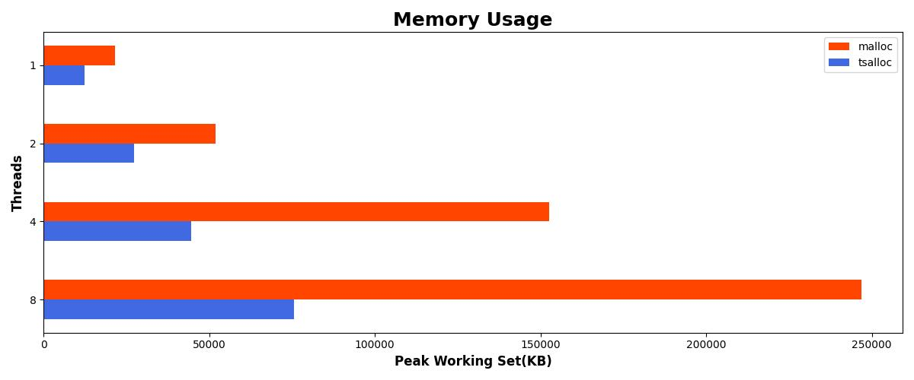

	Machine model: HP ENVY Laptop 13-ah0012TX
	CPU: Intel(R) Core(TM) i5-8250U CPU @ 1.60GHz 1.80GHz
	RAM: 8G 
	OS: Windows 10 Home 64bit, 22H2，19045.5011
    Compiler: VS2019
	teisye.dll: 2.1.1.3536
	heapperf: x86-64, -l 3 -c 15

[20241011_HPENV_win10.txt](20241011_HPENVY_win10.txt)

